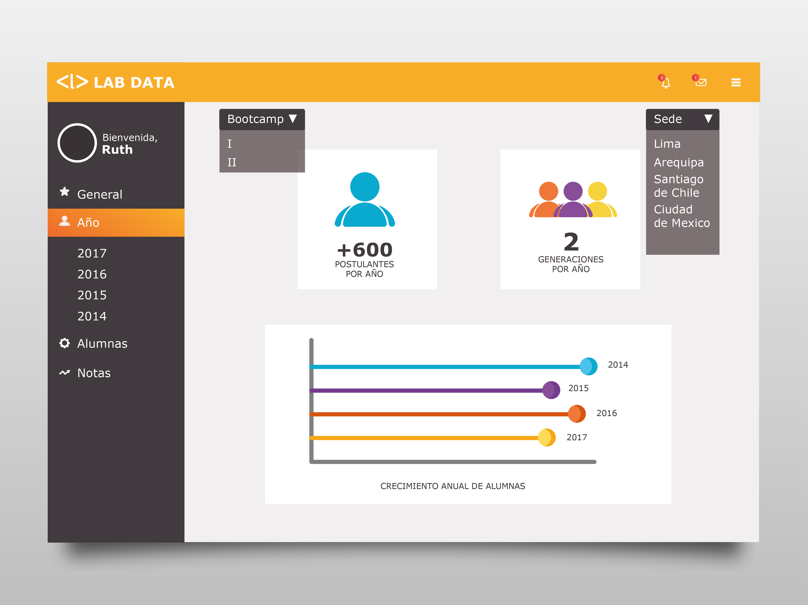
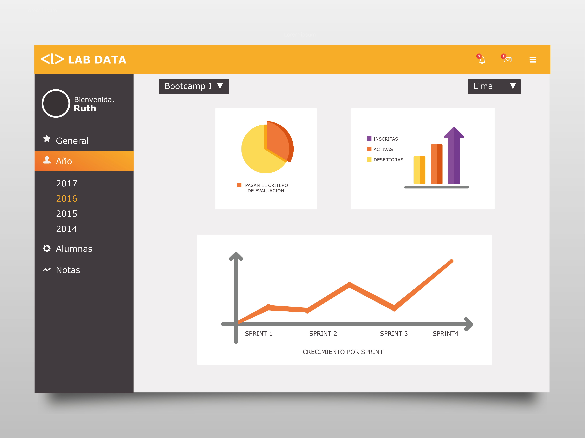
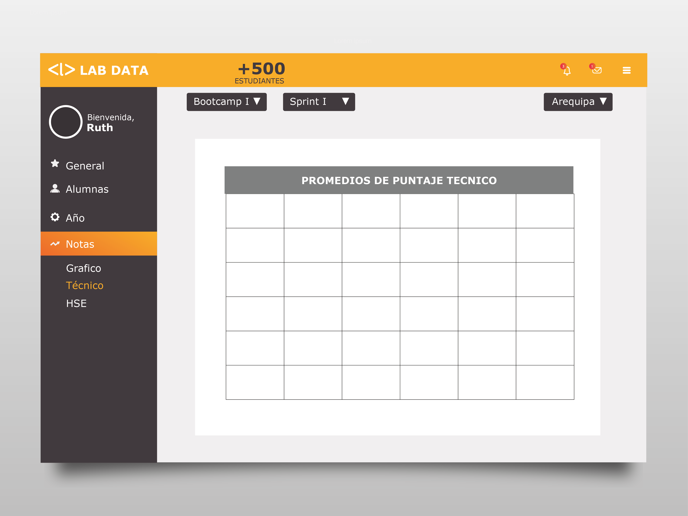

# Reto N° 3

## Objetivo

   * Crear un sketch para la herramienta del dashboard de Laboratoria.
   

 
 
### General

 * Cuando el usuario haya ingresado a su cuenta, le aparecerá un resumen con los datos generales y más importantes de Laboratoria.
 
 
 
 
 ### Año

 * Al entrar en la sección Año, el usuario accederá a los datos de las alumnas y las sedes por año. Se cuentan  2 bootcamp por año, tal como lo indicado en la información.
 
 
  ### Año
 * Al especificar el bootcamp por año y la sede aparecen los datos solicitados
 
  
  ### Alumnas
  * En esta sección podemos ver a las alumnas, podemos selecccionar entre egresadas o cursando y seleccionamos la sede de nuestra         preferencia.

 
 
  ### Notas
 * En esta sección se puede acceder a los promedios y porcentajes de las alumnas.
  
 
